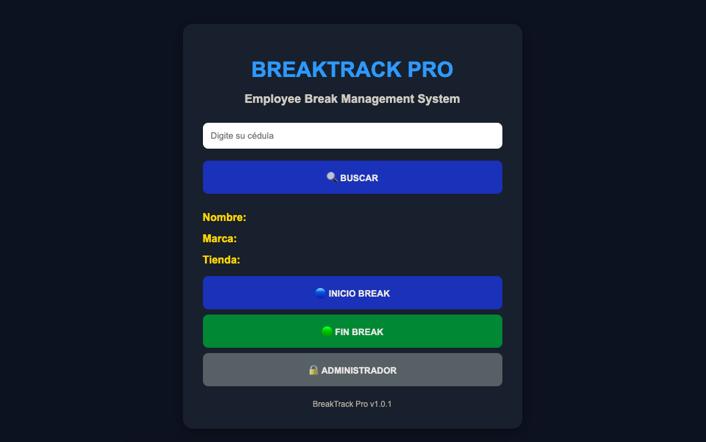

<p align="center">
  
</p>

<h1 align="center">BreakTrack Pro</h1>

<p align="center">
Employee Break Management Platform
</p>

<p align="center">
<b>Smarter Break Management for Better Operations</b>
</p>

<p align="center">


</p>

---

## 📖 Overview

BreakTrack Pro is an employee break management platform designed to digitize, automate, and simplify the operational control of employee breaks.

The platform was created to replace manual tracking processes with a centralized digital workflow that improves operational visibility, ensures consistent application of business rules, and provides real-time information for supervisors and operational leaders.

Employees can quickly register the start and end of their breaks through an intuitive web interface, while the system automatically validates each operation, calculates break duration, classifies compliance status, and records every activity for future analysis.

In addition to daily break registration, BreakTrack Pro provides operational dashboards, historical records, automated rankings, and performance indicators that support monitoring, traceability, and data-driven decision making.

This repository presents the public demonstration version of the platform, preserving the architecture, workflow, and core functionality of the original operational solution while omitting organization-specific information.

---

# 🚀 Features

BreakTrack Pro provides a complete employee break management experience focused on operational efficiency, compliance, and real-time visibility.

| Feature | Description |
|----------|-------------|
| 👤 Employee Identification | Instantly validates employee information before any operation. |
| ⏱ Break Registration | Records break start and end times accurately. |
| 📊 Real-Time Dashboard | Displays operational metrics and key performance indicators. |
| 📈 Performance Analytics | Visualizes break behavior through charts and statistics. |
| ⚠ Compliance Monitoring | Detects delayed returns and policy violations automatically. |
| 🏆 Employee Ranking | Highlights operational performance and compliance levels. |
| 🔐 Administrator Module | Provides secure administration and configuration features. |
| ⚡ Google Apps Script Automation | Automates business logic and operational workflows. |
| ☁ Google Sheets Database | Uses Google Sheets as a lightweight cloud database. |
| 📋 Reporting | Stores historical information for future analysis. |

---

# ⚙ Technology Stack

| Layer | Technology |
|--------|------------|
| Frontend | HTML5, CSS3, JavaScript |
| Backend | Google Apps Script |
| Database | Google Sheets |
| Charts | Google Charts |
| Version Control | Git & GitHub |
| Documentation | Markdown |
| Design | Canva |

---

# 📁 Project Structure

```text
BreakTrack-Pro
│
├── assets/
│   ├── banner/
│   ├── logo/
│   ├── screenshots/
│   └── icons/
│
├── documentation/
├── images/
├── source/
│   ├── Code.gs
│   ├── Index.html
│   ├── Styles.html
│   └── JavaScript.html
│
└── README.md
```

# 📦 Installation

1. Clone the repository.

```bash
git clone https://github.com/sugheiry-alcala/BreakTrack-Pro.git
```

2. Open the project in Visual Studio Code.

3. Create a Google Apps Script project.

4. Copy the source files into your Apps Script project.


# 📸 Screenshots

## Home

> Clean and intuitive interface designed for fast employee identification.



---
---

# 📸 Screenshots

Explore the main modules of **BreakTrack Pro**, designed to provide an intuitive user experience while improving operational efficiency.

---

## 🏠 Home

The home screen allows employees to quickly identify themselves and register their break with a clean and user-friendly interface.

> **Purpose:** Fast employee identification and break registration.


---

## 📊 Dashboard

The dashboard provides real-time operational metrics, compliance indicators, and performance analytics for supervisors and managers.

> **Purpose:** Monitor operations and support data-driven decision making.


---

## 🏆 Employee Ranking

The ranking module highlights employee performance based on operational indicators and compliance metrics.

> **Purpose:** Encourage operational excellence through measurable performance.


---

## ⚙ Administration

The administration panel centralizes configuration, employee management, and system settings.

> **Purpose:** Secure administration and configuration management.


5. Connect the project to your Google Sheets database.

6. Deploy the application as a Web App.

7. Start managing employee breaks.
