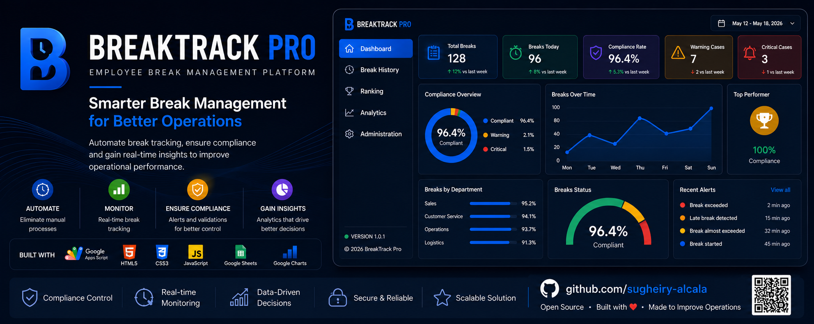

<p align="center">
  
</p>

<h1 align="center">BreakTrack Pro</h1>

<p align="center">
Employee Break Management Platform
</p>

<p align="center">
<b>Smarter Break Management for Better Operations</b>
</p>

<p align="center">


</p>

---

## 📖 Overview


BreakTrack Pro is an employee break management platform designed to digitize, automate, and simplify the operational control of employee breaks.

The platform was created to replace manual tracking processes with a centralized digital workflow that improves operational visibility, ensures consistent application of business rules, and provides real-time information for supervisors and operational leaders.

Employees can quickly register the start and end of their breaks through an intuitive web interface, while the system automatically validates each operation, calculates break duration, classifies compliance status, and records every activity for future analysis.

In addition to daily break registration, BreakTrack Pro provides operational dashboards, historical records, automated rankings, and performance indicators that support monitoring, traceability, and data-driven decision making.

This repository presents the public demonstration version of the platform, preserving the architecture, workflow, and core functionality of the original operational solution while omitting organization-specific information.

---
## 🎯 The Challenge

In many retail environments, employee break management is often handled through manual processes, making it difficult to monitor break durations, enforce company policies, and maintain accurate operational records.

Without a centralized system, supervisors face limited visibility into active breaks, delayed returns, compliance levels, and historical data. This lack of real-time information can lead to inconsistent monitoring, reduced operational efficiency, and limited support for informed decision-making.

BreakTrack Pro was created to address these challenges by replacing manual tracking with a structured digital workflow that automates break registration, enforces business rules, and provides real-time operational insights through centralized reporting and performance indicators.

---
## 💡 The Solution

BreakTrack Pro transforms employee break management into a structured, automated, and traceable process by combining an intuitive web interface with centralized business logic and real-time operational reporting.

Employees can quickly register the start and end of their breaks using their employee identification number. Every operation is automatically validated to prevent duplicate records, multiple active breaks, and unauthorized actions, ensuring data consistency throughout the workflow.

As each break is completed, the platform calculates its duration, classifies the result according to predefined compliance rules, updates operational statistics, and generates performance indicators without requiring manual intervention.

Through integrated dashboards, historical records, and automated rankings, supervisors gain immediate visibility into daily operations, allowing them to monitor compliance, identify exceptions, and support operational decision-making with reliable, real-time information.

---


## ✨ Key Features

### 🔍 Employee Identification

- Search employees using their identification number.
- Display employee information before any operation is performed.
- Validate registered employees against the centralized database.

### ☕ Break Registration

- Register break start and end events.
- Record timestamps automatically.
- Calculate break duration in real time.

### ✅ Business Rule Validation

- Prevent duplicate break registrations.
- Prevent multiple active breaks.
- Validate employee records before processing.
- Apply compliance rules automatically.

### 📊 Operational Dashboard

- Monitor daily break activity.
- Track employees currently on break.
- View compliance percentages.
- Identify tolerance and exceeded cases.
- Access real-time operational metrics.

### 🏆 Performance Ranking

- Generate automatic employee rankings.
- Track compliance history.
- Calculate individual performance indicators.
- Highlight top-performing employees.

### 📁 Historical Records

- Store every registered break.
- Maintain operational traceability.
- Support historical analysis and reporting.

### ⚙️ Administration

- Access operational dashboards.
- Review historical records.
- Monitor performance rankings.
- Manage system configuration.

---
## 🏗️ Architecture

BreakTrack Pro follows a lightweight multi-layer architecture that separates the user interface, business logic, and data management into independent components.

```text
┌───────────────────────────────┐
│        Web Interface          │
│   HTML • CSS • JavaScript     │
└──────────────┬────────────────┘
               │
               │ google.script.run
               ▼
┌───────────────────────────────┐
│     Google Apps Script        │
│    Business Logic Layer       │
└──────────────┬────────────────┘
               │
               ▼
┌───────────────────────────────┐
│        Google Sheets          │
│  Operational Data Storage     │
└──────────────┬────────────────┘
               │
               ▼
┌───────────────────────────────┐
│ Dashboard • Logs • Ranking    │
│ Configuration & Reports        │
└───────────────────────────────┘
```

The presentation layer provides an intuitive interface for employees to register their breaks and interact with the platform.

Business logic is handled by Google Apps Script, where all operational rules are executed, including employee validation, duplicate prevention, break status verification, duration calculation, compliance classification, statistics generation, and automatic ranking updates.

Google Sheets acts as the centralized data repository, storing employee information, operational logs, dashboard metrics, ranking data, and system configuration, enabling real-time monitoring without requiring a traditional database server.
---


## 🌍 Behind the Project

BreakTrack Pro represents the public demonstration version of a solution originally developed to address a real operational challenge in employee break management.

The original implementation was created to replace manual break tracking with a structured digital workflow capable of improving operational visibility, automating business rules, and providing real-time performance insights for supervisors and operational teams.

This repository preserves the architecture, workflow, and core functionality of the original solution while intentionally omitting organization-specific information. Its purpose is to showcase the technical design, development approach, and problem-solving process behind the platform.

Beyond the technologies used, BreakTrack Pro reflects a software engineering mindset focused on understanding operational needs, designing practical solutions, and building systems that create measurable value through automation and data-driven decision-making.
---
## 🚀 Beyond the Code

BreakTrack Pro is more than a software demonstration.

It represents the process of identifying a real operational challenge, understanding business needs, designing a practical solution, and transforming a manual workflow into a structured digital platform.

This project reflects an engineering approach where technology is not the objective itself, but the tool used to solve meaningful problems, improve operational efficiency, and support better decision-making through reliable data.

The public version shared in this repository is intended to demonstrate not only the technical implementation, but also the product thinking, system design, and software engineering principles behind the solution.

## ⚙️ Technology Stack

BreakTrack Pro was built using technologies that provide rapid development, seamless integration with Google Workspace, and a lightweight deployment model suitable for operational environments.

| Technology | Purpose |
|------------|---------|
| **HTML5** | Structures the user interface and application layout. |
| **CSS3** | Provides responsive styling and a clean, intuitive user experience. |
| **JavaScript (ES6)** | Handles client-side interactions, user events, and communication with the backend. |
| **Google Apps Script** | Implements the business logic, validations, operational rules, and server-side processing. |
| **Google Sheets** | Acts as the centralized data repository for employee information, operational logs, dashboards, rankings, and system configuration. |

### Design Approach

The platform follows a lightweight architecture where the presentation layer, business logic, and operational data are clearly separated.

This approach minimizes infrastructure requirements while providing real-time processing, centralized data management, and easy deployment within Google Workspace.

## ⚙️ Technology Stack

BreakTrack Pro was built using technologies that provide rapid development, seamless integration with Google Workspace, and a lightweight deployment model suitable for operational environments.

| Technology | Purpose |
|------------|---------|
| **HTML5** | Structures the user interface and application layout. |
| **CSS3** | Provides responsive styling and a clean, intuitive user experience. |
| **JavaScript (ES6)** | Handles client-side interactions, user events, and communication with the backend. |
| **Google Apps Script** | Implements the business logic, validations, operational rules, and server-side processing. |
| **Google Sheets** | Acts as the centralized data repository for employee information, operational logs, dashboards, rankings, and system configuration. |

### Design Approach

The platform follows a lightweight architecture where the presentation layer, business logic, and operational data are clearly separated.

This approach minimizes infrastructure requirements while providing real-time processing, centralized data management, and easy deployment within Google Workspace.


## 👩‍💻 About the Developer

Hi, I'm **Sugheiry Alcalá**, a Software Developer and Data & AI Analyst passionate about building technology that solves real-world operational challenges.

My work combines software development, data analysis, and product thinking to create practical solutions that improve business processes and support better decision-making.

I believe technology creates the greatest impact when it is designed around people, processes, and real business needs.

If you'd like to connect or learn more about my work:

- 💼 LinkedIn: ...
- 💻 GitHub: ...
