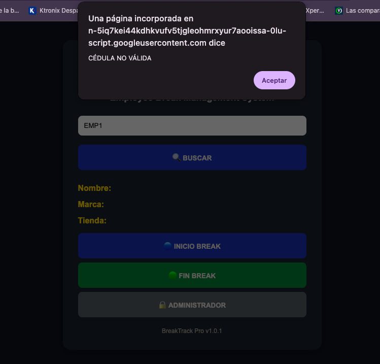
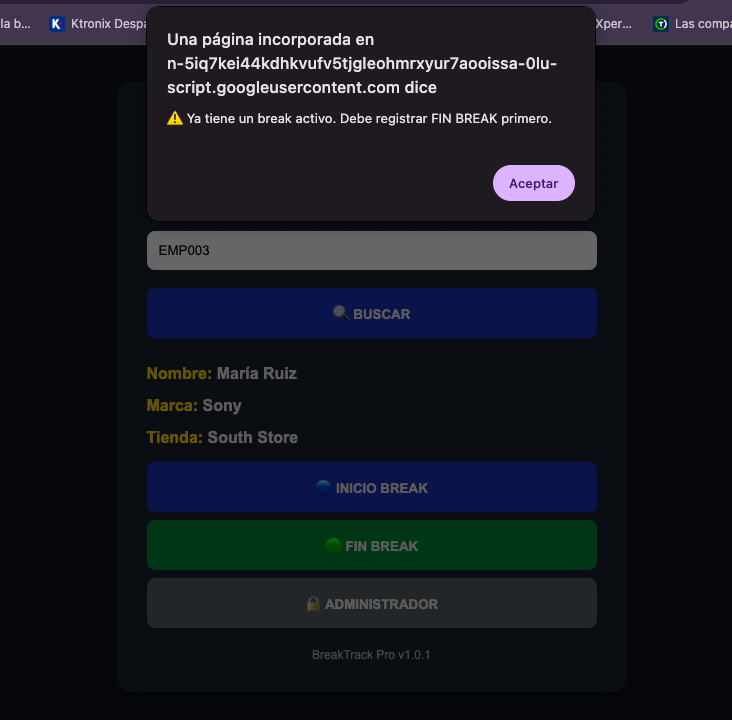
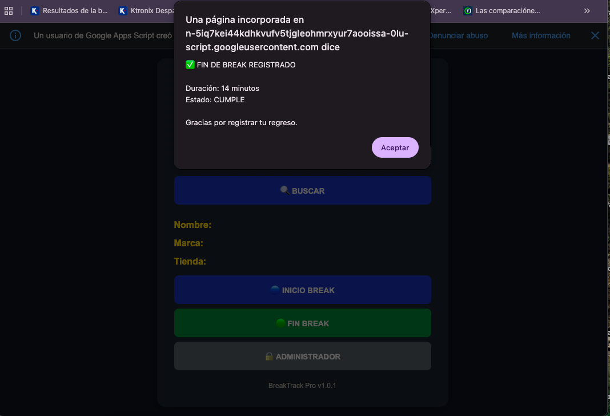
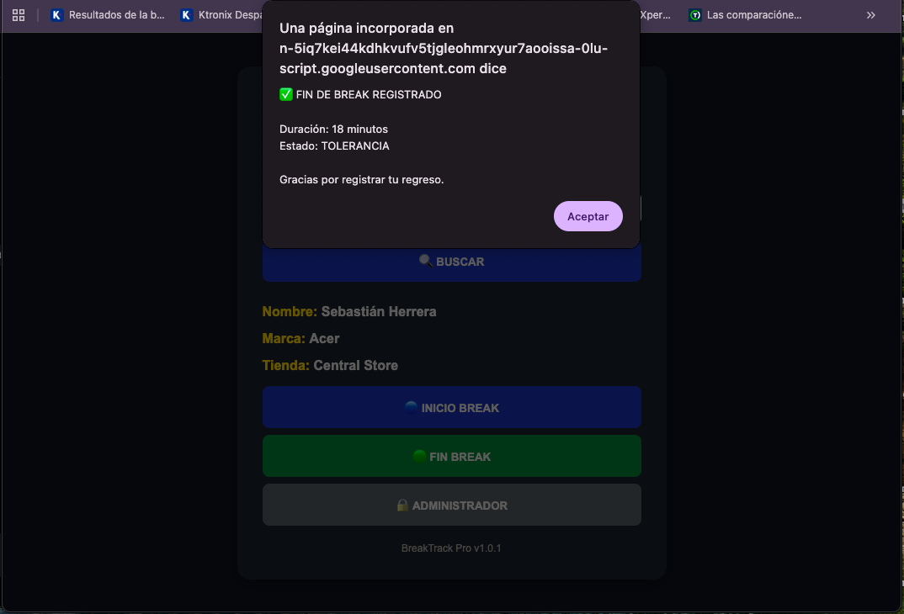
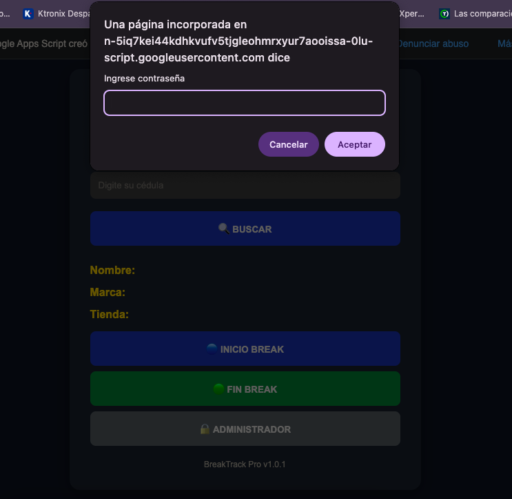
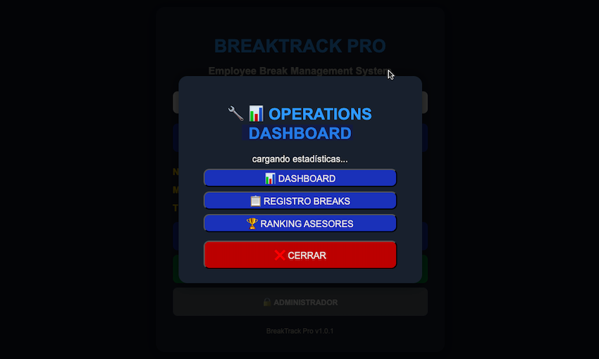
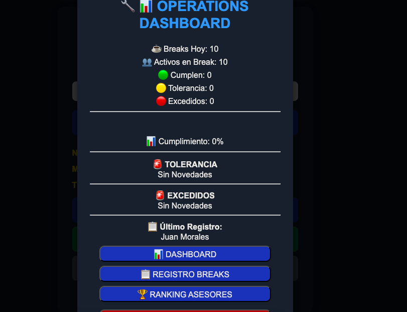
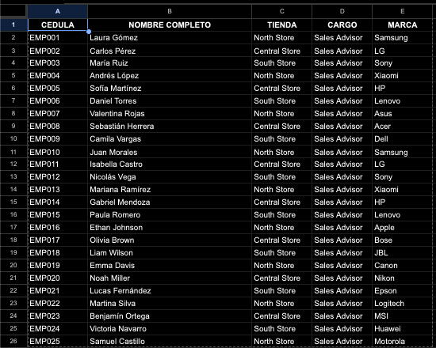
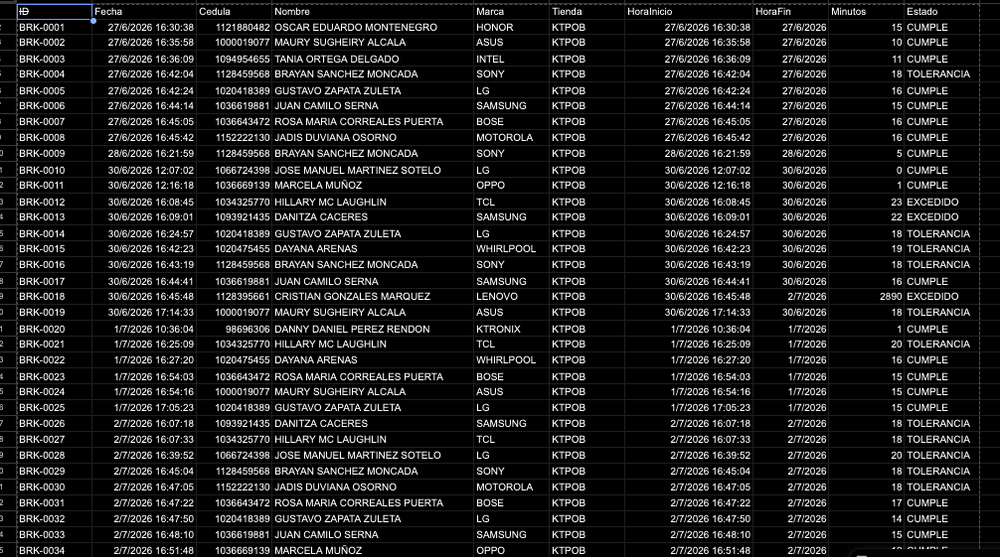
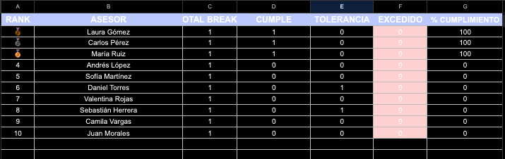

<p align="center">
  
</p>

<h1 align="center">BreakTrack Pro</h1>

<p align="center">
Employee Break Management Platform
</p>

<p align="center">
<b>Smarter Break Management for Better Operations</b>
</p>

<p align="center">


</p>

---

## 📖 Overview

BreakTrack Pro is an employee break management platform designed to digitize, automate, and simplify the operational control of employee breaks.

The platform was created to replace manual tracking processes with a centralized digital workflow that improves operational visibility, ensures consistent application of business rules, and provides real-time information for supervisors and operational leaders.

Employees can quickly register the start and end of their breaks through an intuitive web interface, while the system automatically validates each operation, calculates break duration, classifies compliance status, and records every activity for future analysis.

In addition to daily break registration, BreakTrack Pro provides operational dashboards, historical records, automated rankings, and performance indicators that support monitoring, traceability, and data-driven decision making.

This repository presents the public demonstration version of the platform, preserving the architecture, workflow, and core functionality of the original operational solution while omitting organization-specific information.

---

## 🎯 The Challenge

In many retail environments, employee break management is often handled through manual processes, making it difficult to monitor break durations, enforce company policies, and maintain accurate operational records.

Without a centralized system, supervisors face limited visibility into active breaks, delayed returns, compliance levels, and historical data. This lack of real-time information can lead to inconsistent monitoring, reduced operational efficiency, and limited support for informed decision-making.

BreakTrack Pro was created to address these challenges by replacing manual tracking with a structured digital workflow that automates break registration, enforces business rules, and provides real-time operational insights through centralized reporting and performance indicators.

---

## 💡 The Solution

BreakTrack Pro transforms employee break management into a structured, automated, and traceable process by combining an intuitive web interface with centralized business logic and real-time operational reporting.

Employees can quickly register the start and end of their breaks using their employee identification number. Every operation is automatically validated to prevent duplicate records, multiple active breaks, and unauthorized actions, ensuring data consistency throughout the workflow.

As each break is completed, the platform calculates its duration, classifies the result according to predefined compliance rules, updates operational statistics, and generates performance indicators without requiring manual intervention.

Through integrated dashboards, historical records, and automated rankings, supervisors gain immediate visibility into daily operations, allowing them to monitor compliance, identify exceptions, and support operational decision-making with reliable, real-time information.

---

## ✨ Key Features

### 🔍 Employee Identification

- Search employees using their identification number.
- Display employee information before any operation is performed.
- Validate registered employees against the centralized database.

### ☕ Break Registration

- Register break start and end events.
- Record timestamps automatically.
- Calculate break duration in real time.

### ✅ Business Rule Validation

- Prevent duplicate break registrations.
- Prevent multiple active breaks.
- Validate employee records before processing.
- Apply compliance rules automatically.

### 📊 Operational Dashboard

- Monitor daily break activity.
- Track employees currently on break.
- View compliance percentages.
- Identify tolerance and exceeded cases.
- Access real-time operational metrics.

### 🏆 Performance Ranking

- Generate automatic employee rankings.
- Track compliance history.
- Calculate individual performance indicators.
- Highlight top-performing employees.

### 📁 Historical Records

- Store every registered break.
- Maintain operational traceability.
- Support historical analysis and reporting.

### ⚙️ Administration

- Access operational dashboards.
- Review historical records.
- Monitor performance rankings.
- Manage system configuration.

---

## 🏗️ Architecture

BreakTrack Pro follows a lightweight multi-layer architecture that separates the user interface, business logic, and data management into independent components.

```text
┌───────────────────────────────┐
│        Web Interface          │
│   HTML • CSS • JavaScript     │
└──────────────┬────────────────┘
               │
               │ google.script.run
               ▼
┌───────────────────────────────┐
│     Google Apps Script        │
│    Business Logic Layer       │
└──────────────┬────────────────┘
               │
               ▼
┌───────────────────────────────┐
│        Google Sheets          │
│  Operational Data Storage     │
└──────────────┬────────────────┘
               │
               ▼
┌───────────────────────────────┐
│ Dashboard • Logs • Ranking    │
│ Configuration & Reports        │
└───────────────────────────────┘
```

The presentation layer provides an intuitive interface for employees to register their breaks and interact with the platform.

Business logic is handled by Google Apps Script, where all operational rules are executed, including employee validation, duplicate prevention, break status verification, duration calculation, compliance classification, statistics generation, and automatic ranking updates.

## Google Sheets acts as the centralized data repository, storing employee information, operational logs, dashboard metrics, ranking data, and system configuration, enabling real-time monitoring without requiring a traditional database server.

## 🌍 Behind the Project

BreakTrack Pro represents the public demonstration version of a solution originally developed to address a real operational challenge in employee break management.

The original implementation was created to replace manual break tracking with a structured digital workflow capable of improving operational visibility, automating business rules, and providing real-time performance insights for supervisors and operational teams.

This repository preserves the architecture, workflow, and core functionality of the original solution while intentionally omitting organization-specific information. Its purpose is to showcase the technical design, development approach, and problem-solving process behind the platform.

## Beyond the technologies used, BreakTrack Pro reflects a software engineering mindset focused on understanding operational needs, designing practical solutions, and building systems that create measurable value through automation and data-driven decision-making.

## 🚀 Beyond the Code

BreakTrack Pro is more than a software demonstration.

It represents the process of identifying a real operational challenge, understanding business needs, designing a practical solution, and transforming a manual workflow into a structured digital platform.

This project reflects an engineering approach where technology is not the objective itself, but the tool used to solve meaningful problems, improve operational efficiency, and support better decision-making through reliable data.

The public version shared in this repository is intended to demonstrate not only the technical implementation, but also the product thinking, system design, and software engineering principles behind the solution.

## ⚙️ Technology Stack

BreakTrack Pro was built using technologies that provide rapid development, seamless integration with Google Workspace, and a lightweight deployment model suitable for operational environments.

| Technology             | Purpose                                                                                                                             |
| ---------------------- | ----------------------------------------------------------------------------------------------------------------------------------- |
| **HTML5**              | Structures the user interface and application layout.                                                                               |
| **CSS3**               | Provides responsive styling and a clean, intuitive user experience.                                                                 |
| **JavaScript (ES6)**   | Handles client-side interactions, user events, and communication with the backend.                                                  |
| **Google Apps Script** | Implements the business logic, validations, operational rules, and server-side processing.                                          |
| **Google Sheets**      | Acts as the centralized data repository for employee information, operational logs, dashboards, rankings, and system configuration. |

### Design Approach

The platform follows a lightweight architecture where the presentation layer, business logic, and operational data are clearly separated.

This approach minimizes infrastructure requirements while providing real-time processing, centralized data management, and easy deployment within Google Workspace.

## 🔄 System Workflow

The following workflow illustrates how BreakTrack Pro processes an employee break from registration to operational reporting.

```text
Employee
    │
    ▼
Enter Employee ID
    │
    ▼
Employee Validation
    │
    ├── Invalid ID
    │      │
    │      ▼
    │   Display Error Message
    │
    ▼
Employee Information Loaded
    │
    ▼
Start Break
    │
    ▼
Business Rule Validation
    │
    ├── Active Break
    ├── Duplicate Registration
    └── Valid Request
    │
    ▼
Break Registered
    │
    ▼
Employee Returns
    │
    ▼
End Break
    │
    ▼
Duration Calculation
    │
    ▼
Compliance Classification
    │
    ├── 🟢 Compliant
    ├── 🟡 Tolerance
    └── 🔴 Exceeded
    │
    ▼
Update Logs
    │
    ▼
Update Dashboard
    │
    ▼
Update Performance Ranking
```

Every completed operation automatically updates the operational database, dashboard metrics, historical records, and employee performance rankings, ensuring that supervisors always have access to accurate and up-to-date information.

## 📂 Project Structure

The repository is organized to separate source code, project documentation, and visual assets, making it easier to navigate, maintain, and extend.

```text
BreakTrack-Pro/
│
├── 📁 assets/
│   ├── 🖼️ banner/
│   ├── 🎨 icons/
│   ├── 🅱️ logo/
│   └── 📸 screenshots/
│
├── 📁 documentation/
│
├── 📁 images/
│
├── 📁 source/
│
└── 📄 README.md
```

### Folder Description

| Folder             | Description                                                                                                                    |
| ------------------ | ------------------------------------------------------------------------------------------------------------------------------ |
| **assets/**        | Stores the visual identity of the project, including banners, logos, icons, and screenshots used throughout the documentation. |
| **documentation/** | Contains the project's technical documentation, user manuals, installation guides, and supporting materials.                   |
| **images/**        | Includes additional images and resources referenced by the repository.                                                         |
| **source/**        | Contains the application source code, including the frontend, Google Apps Script backend, and project configuration files.     |
| **README.md**      | Main project documentation providing an overview of the platform, architecture, features, and usage instructions.              |

## 📸 Screenshots

### 🏠 Main Interface

The main interface provides a simple and intuitive workflow for employees to register their breaks. Users can identify themselves, verify their information, and record the start or end of their break in just a few steps.

> _(Insert main interface screenshot here)_

---

### 📊 Operations Dashboard

The Operations Dashboard provides supervisors with real-time operational visibility, including daily break activity, active employees on break, compliance indicators, and performance metrics.

> _(Insert dashboard screenshot here)_

---

### 🏆 Performance Ranking

The Performance Ranking automatically evaluates employee compliance based on completed break records, helping supervisors identify top performers and monitor operational consistency.

> _(Insert ranking screenshot here)_

---

### 📋 Break History

The Break History stores every registered operation, creating a complete audit trail that supports operational traceability and historical analysis.

> _(Insert break history screenshot here)_

# 🚀 Platform Experience

BreakTrack Pro has been designed around two primary user experiences:

- **Employees**, who register and complete their daily breaks through a fast and intuitive workflow.
- **Supervisors**, who monitor operational performance using real-time dashboards, historical records, and automated performance indicators.

The following walkthrough illustrates the platform from both perspectives.

## 👤 Employee Journey

### 🏠 Home Screen

The Home Screen is the primary entry point of BreakTrack Pro.

Employees can quickly identify themselves using their employee ID, verify their assigned information, and register the start or end of a break through a simple and intuitive interface designed for everyday operational use.

<p align="center">
    
</p>

### 🔍 Employee Validation

Before processing any operation, BreakTrack Pro validates the employee ID against the centralized employee database.

If the entered ID does not exist, the system immediately rejects the request and displays an informative validation message, preventing unauthorized or incorrect records from being created.

This validation protects data integrity and guarantees that every registered break belongs to a valid employee.

<p align="center">
    
</p>

## 🚀 Platform Experience

### 👤 Employee Journey

- Home Screen
- Employee Validation
- Invalid Employee
- Active Break Validation
- Break Completion
- Break Completion with Tolerance

### 👨‍💼 Supervisor Journey

- Administrator Access
- Loading Statistics
- Operations Summary
- Operations Dashboard

### 📊 Operational Management

- Employee Database
- Break History
- Performance Ranking

### ⚠️ Active Break Validation

BreakTrack Pro automatically prevents employees from registering multiple active breaks.

Before creating a new break record, the platform verifies whether an unfinished break already exists. If an active break is detected, the request is rejected and the employee receives immediate feedback.

This validation enforces business rules, prevents duplicate records, and preserves the consistency of operational data.

<p align="center">
    
</p>

### ✅ Successful Break Completion

When an employee returns from their break, BreakTrack Pro automatically records the end time and processes the operation without requiring any manual calculations.

The platform immediately calculates the total break duration, evaluates compliance according to predefined business rules, and confirms the successful registration.

Providing instant feedback helps employees verify that their break has been correctly recorded.

<p align="center">
    
</p>

### 🟡 Automatic Compliance Classification

After every completed break, the platform automatically classifies the result according to the configured business rules.

BreakTrack Pro evaluates the elapsed time and assigns one of three compliance levels:

- 🟢 Compliant
- 🟡 Tolerance
- 🔴 Exceeded

This automatic classification provides immediate operational feedback while supplying supervisors with reliable performance indicators for ongoing monitoring.

<p align="center">
    
</p>

Administrator Login

↓

Operations Summary

↓

Operations Dashboard

↓

Historical Records

↓

Performance Ranking

## 👨‍💼 Supervisor Journey

BreakTrack Pro provides supervisors with dedicated operational tools to monitor employee break activity, review compliance metrics, and access historical information in real time.

The administration workflow is designed to provide immediate operational visibility while maintaining a simple and intuitive user experience.

### 🔐 Administrator Access

Administrative functions are protected through a dedicated authentication step.

Only authorized personnel can access operational statistics, historical records, dashboards, and performance reports, ensuring that management features remain restricted to supervisors.

<p align="center">
    
</p>

### 📈 Real-Time Statistics

After successful authentication, BreakTrack Pro automatically retrieves the latest operational data and prepares the management dashboard.

This process ensures that supervisors always access up-to-date information before navigating through the platform's operational modules.

<p align="center">
    
</p>
### 📊 Operational Snapshot

The Operations Summary provides supervisors with an instant overview of the current operational status.

Key performance indicators, active breaks, compliance levels, and recent activity are consolidated into a single view, allowing managers to quickly identify situations that require attention.

<p align="center">
    
</p>

## 👨‍💼 Supervisor Journey

BreakTrack Pro provides supervisors with dedicated operational tools to monitor employee break activity, review compliance metrics, and access historical information in real time.

The administration workflow has been designed to provide immediate operational visibility while maintaining a simple and intuitive user experience.

### 🔐 Administrator Access

Administrative features are protected through a dedicated authentication step.

Only authorized personnel can access operational statistics, dashboards, historical records, and performance reports, ensuring that management functions remain restricted to supervisors.

<p align="center">
    
</p>

### 📈 Real-Time Statistics

Once authentication is completed, BreakTrack Pro retrieves the latest operational data and prepares the administration panel.

This process guarantees that supervisors always work with up-to-date information before accessing the available management modules.

<p align="center">
    
</p>

### 📊 Operational Snapshot

The administration panel presents a real-time overview of daily break activity.

Supervisors can instantly monitor registered breaks, employees currently on break, compliance levels, tolerance cases, exceeded limits, and the latest recorded activity.

By consolidating operational metrics into a single view, the platform enables faster decision-making and proactive supervision.

<p align="center">
    
</p>
## 📊 Operational Management

### 📈 Operations Dashboard

The Operations Dashboard consolidates key performance indicators into a centralized view that supports operational monitoring.

Supervisors can evaluate daily compliance, active breaks, employee performance, and operational trends through automatically updated metrics and visual indicators.

<p align="center">
    
</p>

### 👥 Employee Database

The Employee Database serves as the master data repository for the platform.

It stores employee identification, names, assigned brands, and store information used throughout the validation and break registration process.

Maintaining a centralized employee directory ensures data consistency across all operational modules.

<p align="center">
    
</p>
### 📋 Break History

Every completed operation is automatically stored in the historical log, providing complete traceability of employee break activity.

Each record includes timestamps, calculated duration, compliance status, and employee information, supporting audits, operational analysis, and historical reporting.

<p align="center">
    
</p>
### 🏆 Performance Ranking

The Performance Ranking automatically evaluates employee compliance based on completed break records.

Using operational indicators such as compliant breaks, tolerance cases, exceeded limits, and compliance percentage, supervisors can easily identify performance trends and support continuous operational improvement.

<p align="center">
    
</p>

# 🚀 Getting Started

This repository contains the public demonstration version of **BreakTrack Pro**, preserving the architecture, workflow, and core functionality of the original operational solution.

## Prerequisites

Before deploying the application, make sure you have access to:

- A Google Account
- Google Sheets
- Google Apps Script
- A modern web browser

---

## Project Setup

1. Create a new Google Spreadsheet.

2. Open **Extensions → Apps Script**.

3. Copy the project source files into the Apps Script editor.

4. Create the required worksheets:

- `EMPLOYEE_DATABASE`
- `BREAK_LOGS`
- `DASHBOARD`
- `PERFORMANCE_RANKING`
- `CONFIGURATION`

5. Deploy the project as a **Web App**.

6. Grant the required Google Apps Script permissions.

7. Open the generated Web App URL to start using BreakTrack Pro.

---

## Configuration

Before using the application, populate the employee database with the required information:

- Employee ID
- Employee Name
- Brand
- Store

Once configured, employees can immediately begin registering their breaks.

# 🚀 Getting Started

This repository contains the public demonstration version of **BreakTrack Pro**, preserving the architecture, workflow, and core functionality of the original operational solution.

## Prerequisites

Before deploying the application, make sure you have access to:

- A Google Account
- Google Sheets
- Google Apps Script
- A modern web browser

---

## Project Setup

1. Create a new Google Spreadsheet.

2. Open **Extensions → Apps Script**.

3. Copy the project source files into the Apps Script editor.

4. Create the required worksheets:

- `EMPLOYEE_DATABASE`
- `BREAK_LOGS`
- `DASHBOARD`
- `PERFORMANCE_RANKING`
- `CONFIGURATION`

5. Deploy the project as a **Web App**.

6. Grant the required Google Apps Script permissions.

7. Open the generated Web App URL to start using BreakTrack Pro.

---

## Configuration

Before using the application, populate the employee database with the required information:

- Employee ID
- Employee Name
- Brand
- Store

Once configured, employees can immediately begin registering their breaks.

# 🌍 Behind the Project

BreakTrack Pro represents the public demonstration version of a solution originally developed to address a real operational challenge in employee break management.

The project was inspired by the need to replace manual break tracking with a centralized digital workflow capable of improving operational visibility, automating business rules, and providing reliable real-time information for supervisors.

This public repository preserves the architecture, workflow, and core functionality of the original solution while intentionally excluding organization-specific information.

More than demonstrating a technical implementation, BreakTrack Pro showcases a practical software engineering approach focused on understanding business needs, designing effective solutions, and creating measurable operational value through automation and data-driven decision-making.

# 👩‍💻 About the Developer

Hi, I'm **Sugheiry Alcalá**.

I'm a **Software Developer** and **Data & AI Analyst** passionate about building technology that solves real-world operational challenges.

My professional interests combine software development, data analysis, artificial intelligence, and product thinking to create practical solutions that improve business processes and support better decision-making.

I enjoy transforming operational needs into digital products that are intuitive, reliable, and focused on delivering measurable value.

## Let's Connect

- 💼 **LinkedIn:** https://www.linkedin.com/in/sugheiry-alcala/
- 💻 **GitHub:** https://github.com/sugheiry-alcala

# 📄 License

This project is licensed under the MIT License.

Feel free to explore, learn from, and adapt the code for educational and personal purposes.

See the LICENSE file for more information.

---

<p align="center">

**Transforming operational challenges into practical software solutions.**

Built with ❤️ by **Sugheiry Alcala**

</p>
